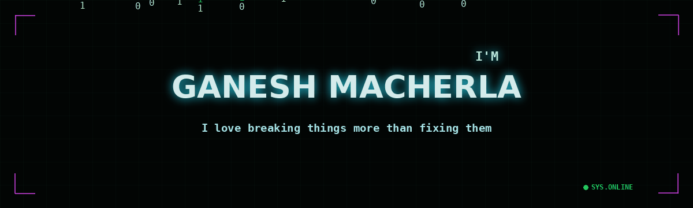

## Heyy, how you doin' ;)



<p align="left">
  <a href="https://www.linkedin.com/in/ganesh-macherla-05713b319/"></a>
  <a href="mailto:myselfganesh65@gmail.com"></a>
</p>

<details>
<summary>GitHub Statistics (ps: its bad)</summary>
<br>


</details>

---

### Currently building

**A composable systems stack in Java**. Five projects, each one a library imported by the next, culminating in a simplified Temporal-style workflow orchestration engine:

```
concurrent rate limiter → durable key-value store → reliable webhook delivery
→ distributed job queue → workflow orchestration engine (capstone)
```

---

### Research

**Reliability-Aware Asynchronous Federated Learning (RA-AFL)**
A cross-layer optimization approach for improving reliability and efficiency in federated learning across heterogeneous Internet-of-Federated-Things (IoFT) environments.

---

### Portfolio

This is my very own Portfolio blogsite. Yes, a blogsite and a portfolio. Here, you'll find my projects, technical write-ups, and insights into the technologies I'm exploring and building with or just random 2AM thoughts.

Machu's Archives

---

### Focus areas

| Area | Details |
|---|---|
| **AI / ML** | Currently deep in: ML fundamentals, LLM internals & integration |
| **Core CS** | Data Structures & Algorithms, COA, Systems Thinking, OS |
| **Distributed Systems** | Fault tolerance, orchestration, async processing |
| **IoT** | Hardware-software integration, network optimization, sensors and microcontrollers |

---

### Stack

```
AI / ML       Learning right now: ML fundamentals · model training · LLM tooling
Languages     Java · Python · C · C++ · JavaScript
Web           React · Next.js
Systems/IoT   Embedded protocols · Raspberry Pi · Networking
```

---

### I'm weird

- Curiosity over speed. I'd rather understand *why* than ship fast
- I accidentally break things, learn why they broke, fix them, and pretending it was all part of the plan. :)

---

<p align="left"><i>Reach out to me about systems, IoT, ML, or anything, really :D</i></p>
